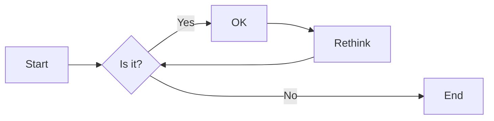

# 实验二 Python变量、简单数据类型

班级： 21计科1班

学号： B20210302424

姓名： 张三

Github地址：<https://github.com/zhoujing204>

CodeWars地址：<https://www.codewars.com/dashboard>

---

## 实验目的

1. 使用VSCode编写和运行Python程序
2. 学习Python变量和简单数据类型

## 实验环境

1. Git
2. Python 3.10
3. VSCode
4. VSCode插件

## 实验内容和步骤

### 第一部分

实验环境的安装

1. 安装Python，从Python官网下载Python 3.10安装包，下载后直接点击可以安装：[Python官网地址](https://www.python.org/downloads/)
2. 为了在VSCode集成环境下编写和运行Python程序，安装下列VScode插件
   - Python
   - Python Environment Manager
   - Python Indent
   - Python Extended
   - Python Docstring Generator
   - Jupyter
   - indent-rainbow
   - Jinja

---

### 第二部分

Python变量、简单数据类型和列表简介

完成教材《Python编程从入门到实践》下列章节的练习：

- 第2章 变量和简单数据类型

---

### 第三部分

在[Codewars网站](https://www.codewars.com)注册账号，完成下列Kata挑战：

---

#### 第1题：求离整数n最近的平方数（Find Nearest square number）

难度：8kyu

你的任务是找到一个正整数n的最近的平方数
例如，如果n=111，那么nearest_sq(n)（nearestSq(n)）等于121，因为111比100（10的平方）更接近121（11的平方）。
如果n已经是完全平方（例如n=144，n=81，等等），你需要直接返回n。
代码提交地址
<https://www.codewars.com/kata/5a805d8cafa10f8b930005ba>

```python
def nearest_sq(n):
    return round(n ** 0.5) ** 2
```

---

#### 第2题：弹跳的球（Bouncing Balls）

难度：6kyu

一个孩子在一栋高楼的第N层玩球。这层楼离地面的高度h是已知的。他把球从窗口扔出去。球弹了起来,  例如:弹到其高度的三分之二（弹力为0.66）。他的母亲从离地面w米的窗户向外看,母亲会看到球在她的窗前经过多少次（包括球下落和反弹的时候）？

一个有效的实验必须满足三个条件：

- 参数 "h"（米）必须大于0
- 参数 "bounce "必须大于0且小于1
- 参数 “window "必须小于h。

如果以上三个条件都满足，返回一个正整数，否则返回-1。
**注意:只有当反弹球的高度严格大于窗口参数时，才能看到球。**
代码提交地址
<https://www.codewars.com/kata/5544c7a5cb454edb3c000047/train/python>


```python
def bouncing_ball(h, bounce, window):
    # your code
        if h <= 0 or bounce >= 1 or bounce <= 0 or window >= h:
            return -1
        count = 1
        h *= bounce
        while h > window:
            count += 2
            h *= bounce
        return count
```
---

#### 第3题： 元音统计(Vowel Count)

难度： 7kyu

返回给定字符串中元音的数量（计数）。对于这个Kata，我们将考虑a、e、i、o、u作为元音（但不包括y）。输入的字符串将只由小写字母和/或空格组成。

代码提交地址：
<https://www.codewars.com/kata/54ff3102c1bad923760001f3>

```python
def get_count(sentence):
    vowels = 'aeiou'
    count = 0
    for char in sentence:
        if char.lower() in vowels:
            count += 1
    return count

```
---

#### 第4题：偶数或者奇数（Even or Odd）

难度：8kyu

创建一个函数接收一个整数作为参数，当整数为偶数时返回”Even”当整数位奇数时返回”Odd”。
代码提交地址：
<https://www.codewars.com/kata/53da3dbb4a5168369a0000fe>


```python
def even_or_odd(number):
    if number % 2 == 0:
        return 'Even'
    else:
        return 'Odd'

```
### 第四部分

使用Mermaid绘制程序流程图

安装Mermaid的VSCode插件：

- Markdown Preview Mermaid Support
- Mermaid Markdown Syntax Highlighting

使用Markdown语法绘制你的程序绘制程序流程图（至少一个），Markdown代码如下：


显示效果如下：




---
#### 第4题：偶数或者奇数（Even or Odd）

难度：8kyu

创建一个函数接收一个整数作为参数，当整数为偶数时返回”Even”当整数位奇数时返回”Odd”。


```mermaid
even_or_odd;
    A[开始]-->B[输入number];
    B-->C[判断number是否为偶数];
    C-->|是|D[输出Even];
    C-->|否|E[输出Odd];
    D-->F[结束];
    E-->F;

```

查看Mermaid流程图语法-->[点击这里](https://mermaid.js.org/syntax/flowchart.html)

使用Markdown编辑器（例如VScode）编写本次实验的实验报告，包括[实验过程与结果](#实验过程与结果)、[实验考查](#实验考查)和[实验总结](#实验总结)，并将其导出为 **PDF格式** 来提交。

## 实验过程与结果

请将实验过程与结果放在这里，包括：

- [第二部分 Python变量、简单数据类型和列表简介](#第二部分)
- [第三部分 Codewars Kata挑战](#第三部分)
- [第四部分 使用Mermaid绘制程序流程图](#第四部分)

注意代码需要使用markdown的代码块格式化，例如Git命令行语句应该使用下面的格式：


显示效果如下：

```bash
git init
git add .
git status
git commit -m "first commit"
```

如果是Python代码，应该使用下面代码块格式，例如：


显示效果如下：

```python
def add_binary(a,b):
    return bin(a+b)[2:]
```


#### 第1题：求离整数n最近的平方数（Find Nearest square number）

难度：8kyu

你的任务是找到一个正整数n的最近的平方数
例如，如果n=111，那么nearest_sq(n)（nearestSq(n)）等于121，因为111比100（10的平方）更接近121（11的平方）。
如果n已经是完全平方（例如n=144，n=81，等等），你需要直接返回n。
代码提交地址
<https://www.codewars.com/kata/5a805d8cafa10f8b930005ba>

```python
def nearest_sq(n):
    return round(n ** 0.5) ** 2
```

---

#### 第2题：弹跳的球（Bouncing Balls）

难度：6kyu

一个孩子在一栋高楼的第N层玩球。这层楼离地面的高度h是已知的。他把球从窗口扔出去。球弹了起来,  例如:弹到其高度的三分之二（弹力为0.66）。他的母亲从离地面w米的窗户向外看,母亲会看到球在她的窗前经过多少次（包括球下落和反弹的时候）？

一个有效的实验必须满足三个条件：

- 参数 "h"（米）必须大于0
- 参数 "bounce "必须大于0且小于1
- 参数 “window "必须小于h。

如果以上三个条件都满足，返回一个正整数，否则返回-1。
**注意:只有当反弹球的高度严格大于窗口参数时，才能看到球。**
代码提交地址
<https://www.codewars.com/kata/5544c7a5cb454edb3c000047/train/python>


```python
def bouncing_ball(h, bounce, window):
    # your code
        if h <= 0 or bounce >= 1 or bounce <= 0 or window >= h:
            return -1
        count = 1
        h *= bounce
        while h > window:
            count += 2
            h *= bounce
        return count
```


---

#### 第3题： 元音统计(Vowel Count)

难度： 7kyu

返回给定字符串中元音的数量（计数）。对于这个Kata，我们将考虑a、e、i、o、u作为元音（但不包括y）。输入的字符串将只由小写字母和/或空格组成。

代码提交地址：
<https://www.codewars.com/kata/54ff3102c1bad923760001f3>

```python
def get_count(sentence):
    vowels = 'aeiou'
    count = 0
    for char in sentence:
        if char.lower() in vowels:
            count += 1
    return count

```


---

#### 第4题：偶数或者奇数（Even or Odd）

难度：8kyu

创建一个函数接收一个整数作为参数，当整数为偶数时返回”Even”当整数位奇数时返回”Odd”。
代码提交地址：
<https://www.codewars.com/kata/53da3dbb4a5168369a0000fe>


```python
def even_or_odd(number):
    if number % 2 == 0:
        return 'Even'
    else:
        return 'Odd'

```


---
代码运行结果的文本可以直接粘贴在这里。

**注意：不要使用截图，Markdown文档转换为Pdf格式后，截图可能会无法显示。**

## 实验考查

请使用自己的语言并使用尽量简短代码示例回答下面的问题，这些问题将在实验检查时用于提问和答辩以及实际的操作。

1. Python中的简单数据类型有那些？我们可以对这些数据类型做哪些操作？

Python中的简单数据类型有6种：数字 (Number)、字符串 (String)、列表 (List)、元组 (Tuple)、字典 (Dictionary)、集合 (Set) ¹.

以下是对这些数据类型的常见操作：

- 数字：支持加减乘除等基本算术运算，以及比较运算符（如等于、大于等）¹.
- 字符串：支持索引、切片、分割、长度等操作¹.
- 列表：支持增加、插入、删除、查询等操作¹.
- 元组：支持索引、切片、循环、长度、包含等操作¹.
- 字典：支持增加、删除、查询等操作¹.
- 集合：支持增加、删除、交集、并集、差集等操作¹.

2. 为什么说Python中的变量都是标签？

在Python中，变量是一个指向内存地址的名称或标签，它们用于引用不同类型的数据对象，并且具有灵活的命名规则、动态类型语言和类型推断等特点².

Python中的变量名是占内存的，一般是存到命名空间中，这个命名空间本质上就是一个字典，这个字典的键就是变量名，值就是变量值¹. 变量本身没有类型信息，真正的信息都在对象身上³.

给变量赋值就是相当于给对象贴标签，就像我们给人取名字一样。变量本身没有任何意义，它没有类型信息，真正的信息都在对象身上³.

3. 有哪些方法可以提高Python代码的可读性？


Python是一种易于学习和使用的编程语言，但是编写可读性高的代码是一项重要的技能。以下是提高Python代码可读性的一些方法：

遵循PEP 8规范：PEP 8是Python官方的代码风格指南，它提供了一些规则和建议，以帮助开发人员编写易于阅读和维护的代码1.
使用有意义的变量名：变量名应该简洁明了，能够准确地描述变量所代表的含义2.
注释代码：注释应该清晰明了，能够解释代码的作用和目的。注释应该放在代码上方或右侧，并且应该避免使用无意义或重复的注释1.
使用空格和缩进：空格和缩进可以使代码更易于阅读。例如，在函数定义中，参数列表、函数名和冒号之间应该有一个空格；在函数体中，缩进应该为4个空格1.
避免使用过长的代码行：建议将每行代码限制在80个字符以内1.

## 实验总结

通过这次实验加深了对python语法的使用 与加深了python的算法的使用

总结一下这次实验你学习和使用到的知识，例如：编程工具的使用、数据结构、程序语言的语法、算法、编程技巧、编程思想。
